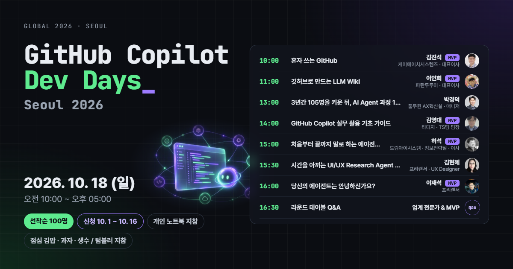
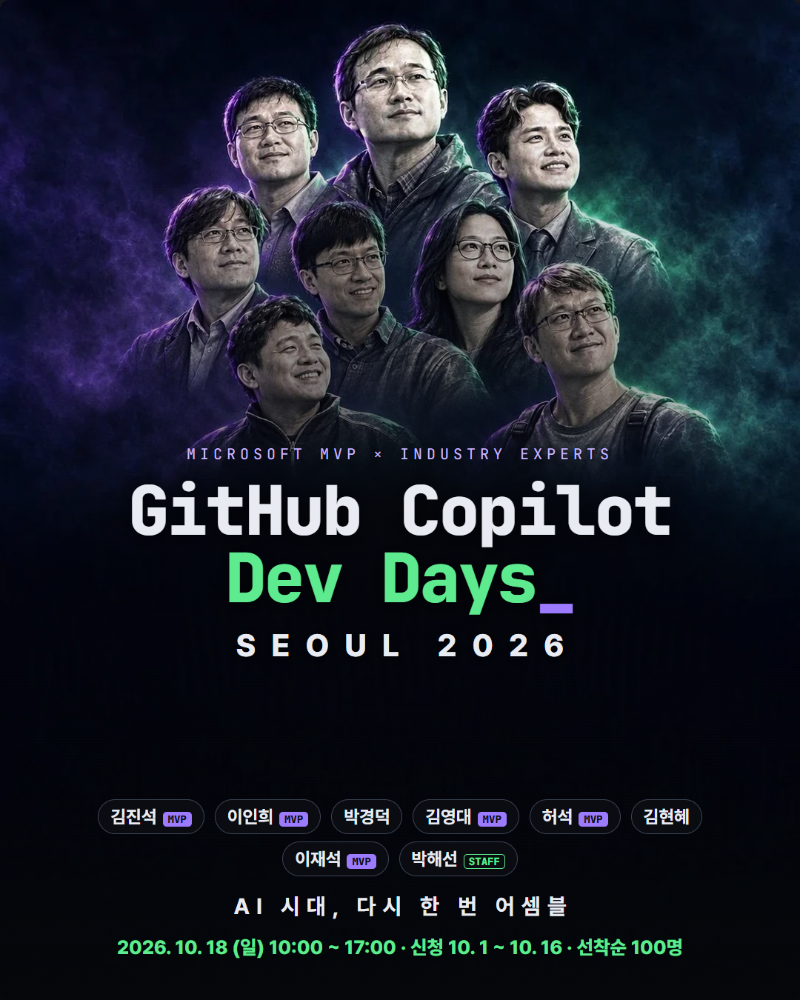
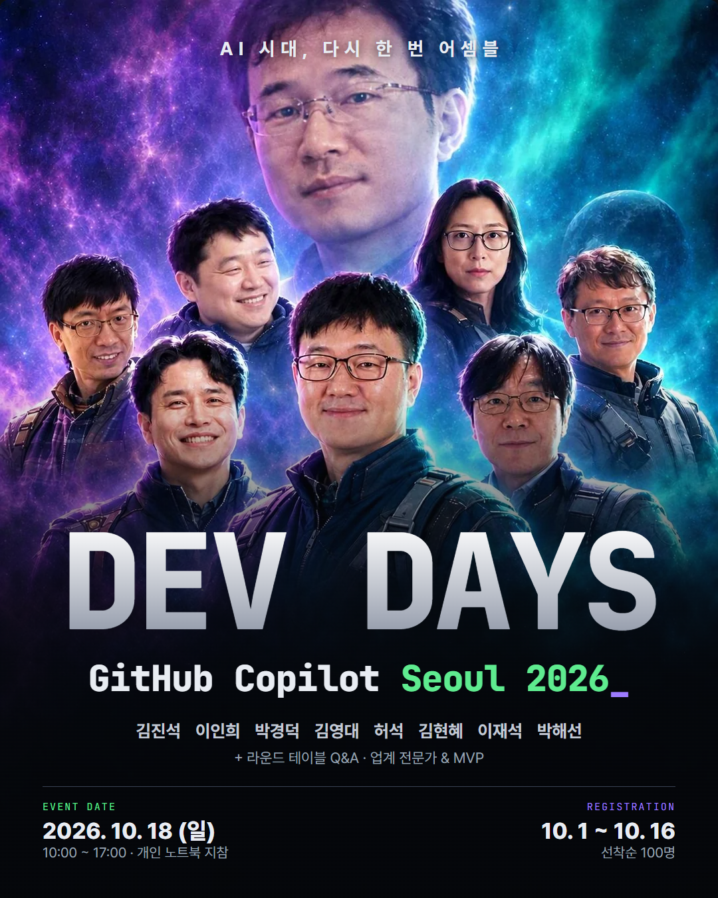
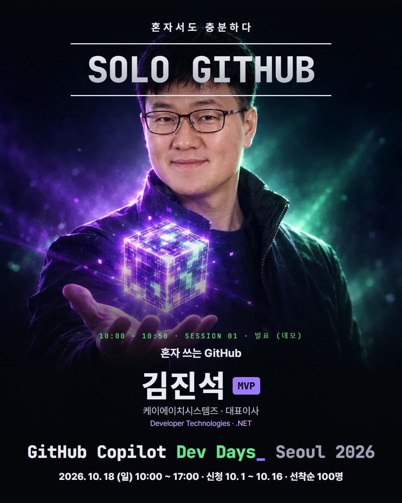
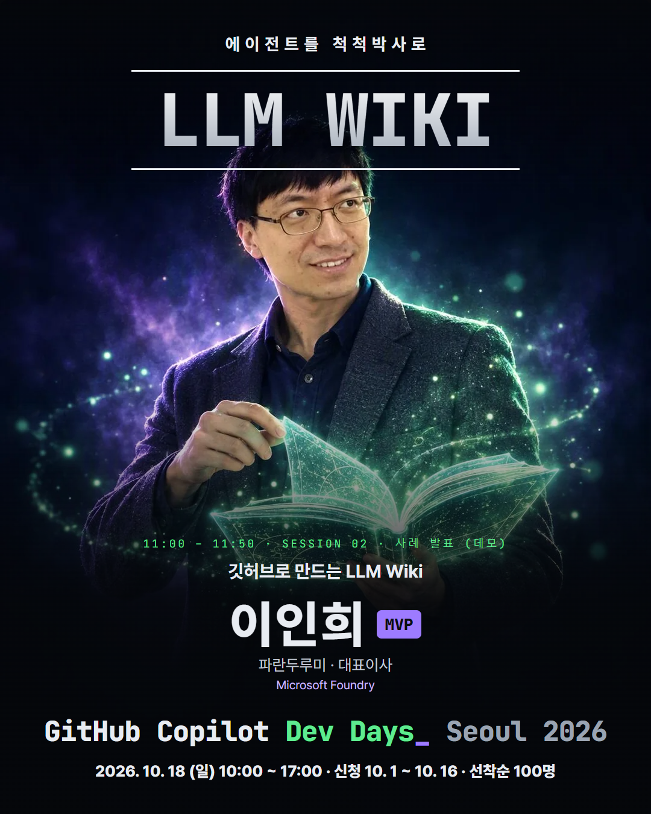
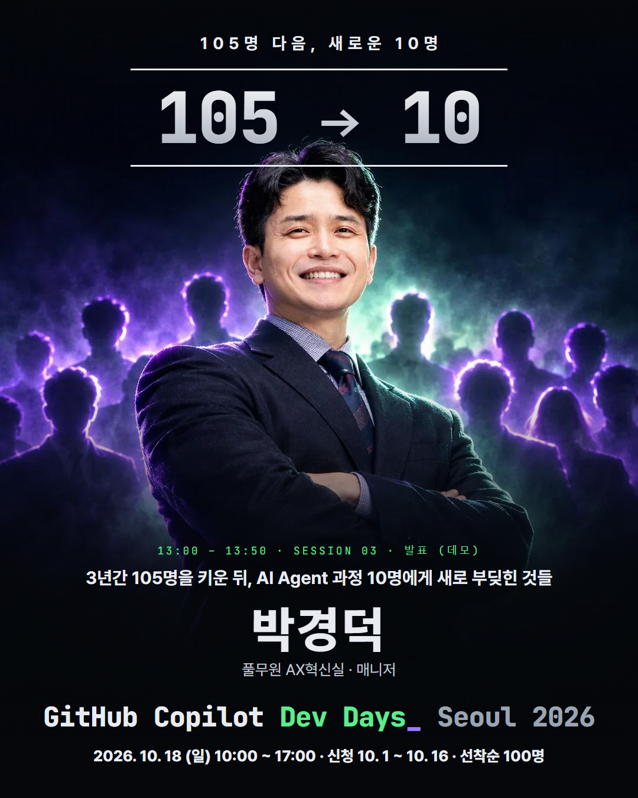
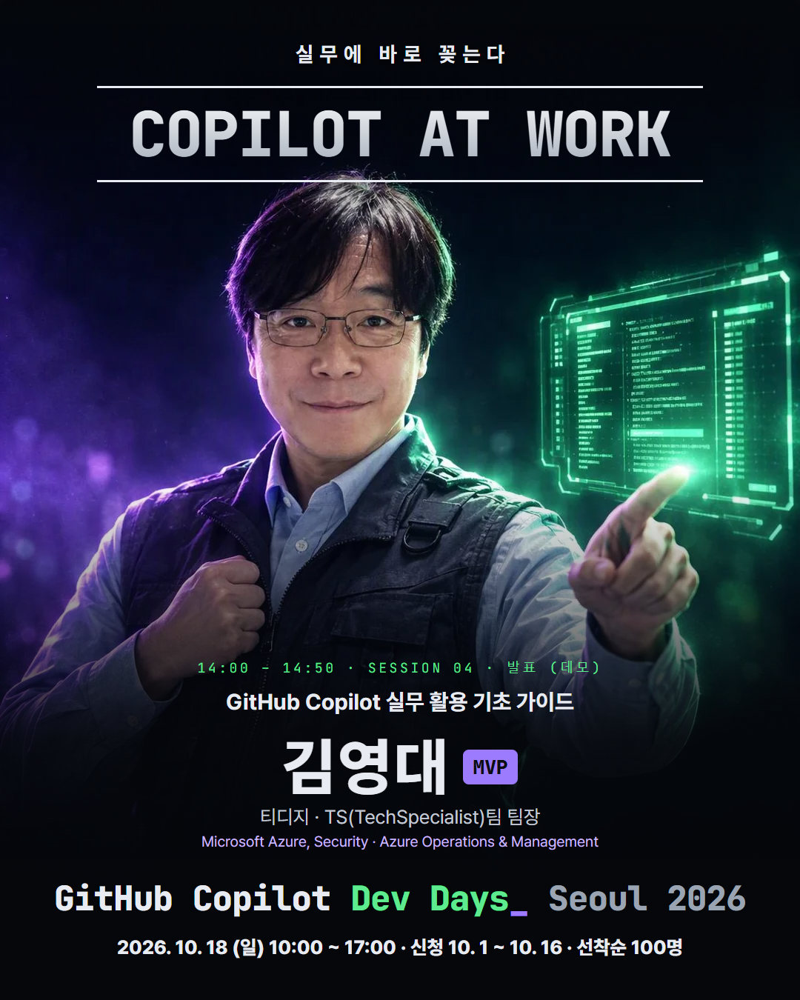
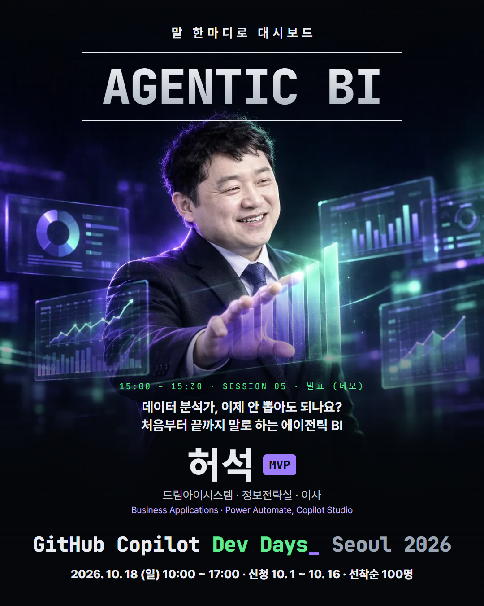
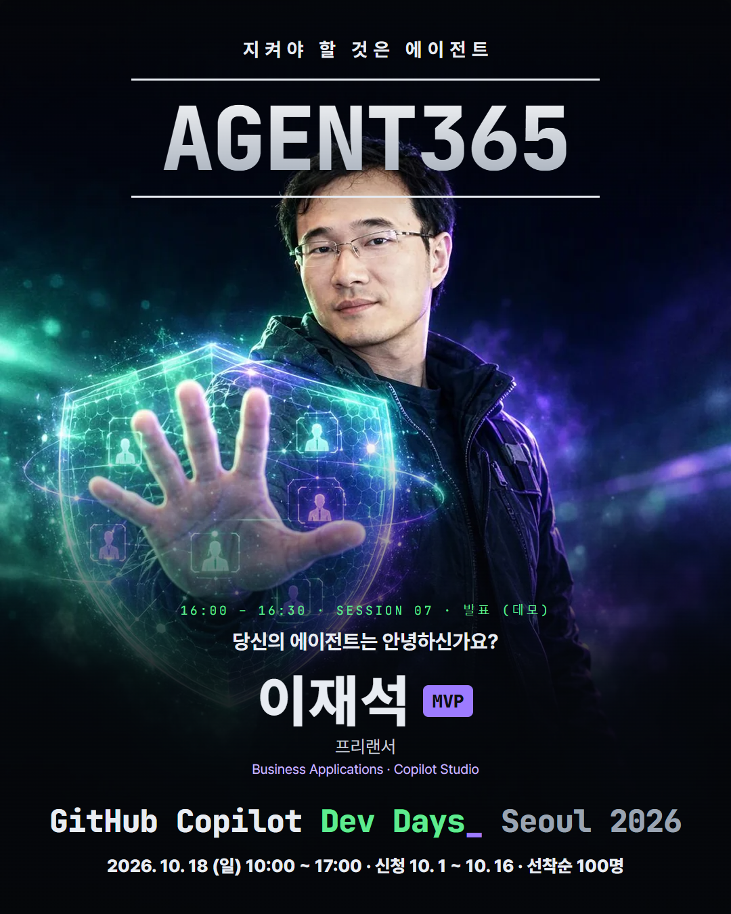

# GitHub Copilot Dev Days Seoul 2026

글로벌 GitHub Copilot Dev Days(9/1 ~ 10/31, 전 세계 오프라인 커뮤니티 이벤트)의 서울 행사 자료입니다.

- **안내 페이지**: https://power-platform-users-korea.github.io/copilot-dev-days-seoul-2026/
- **신청**: https://event-us.kr/m/136275/62279
- **일시**: 2026. 10. 18 (일) 10:00 ~ 17:00
- **모집**: 2026. 10. 1 (목) ~ 10. 16 (금), 선착순 100명
- **준비물**: 개인 노트북 (대여 없음), 텀블러
- **오거나이저**: 이재석, 허석 · **스탭**: 박해선, 이인희, 김현혜 · **장소 후원**: 한국마이크로소프트

## 폴더

| 폴더 | 내용 |
| --- | --- |
| [`guide/`](guide/) | 안내 페이지(`index.html`)와 전체 캡처 이미지(`guide-page.png`) |
| [`posters/`](posters/) | 영화 포스터 스타일 홍보 이미지 9장 (단체 2, 발표자 7), 1080×1350 |
| [`banners/`](banners/) | SNS 배너 3장: Facebook 1200×630, LinkedIn 1200×1200, Instagram 1080×1350 |

## 프로그램

| 시간 | 세션 | 발표자 |
| --- | --- | --- |
| 10:00–10:50 | 혼자 쓰는 GitHub | 김진석 |
| 11:00–11:50 | M365로 만드는 LLM Wiki - 에이전트를 척척박사로 만들어 볼까요? | 이인희 |
| 13:00–13:50 | 3년간 105명을 키운 뒤, AI Agent 과정 10명에게 새로 부딪힌 것들 | 박경덕 |
| 14:00–14:50 | GitHub Copilot 실무 활용 기초 가이드(Azure DevOps, Confluence 연동 등) | 김영대 |
| 15:00–15:30 | 데이터 분석가, 이제 안 뽑아도 되나요? 처음부터 끝까지 말로 하는 에이전틱 BI | 허석 |
| 15:30–16:00 | 시간을 아끼는 UI/UX Research Agent 어떠세요? | 김현혜 |
| 16:00–16:30 | 당신의 에이전트는 안녕하신가요? | 이재석 |
| 16:30–17:00 | 라운드 테이블 Q&A | 업계 전문가 & MVP |

## 포스터

| | | |
| --- | --- | --- |
|  |  |  |
|  |  |  |
|  |  |  |

포스터 인물 이미지는 발표자가 제공한 사진을 참조해 Azure AI Foundry 이미지 모델로 생성했습니다.
